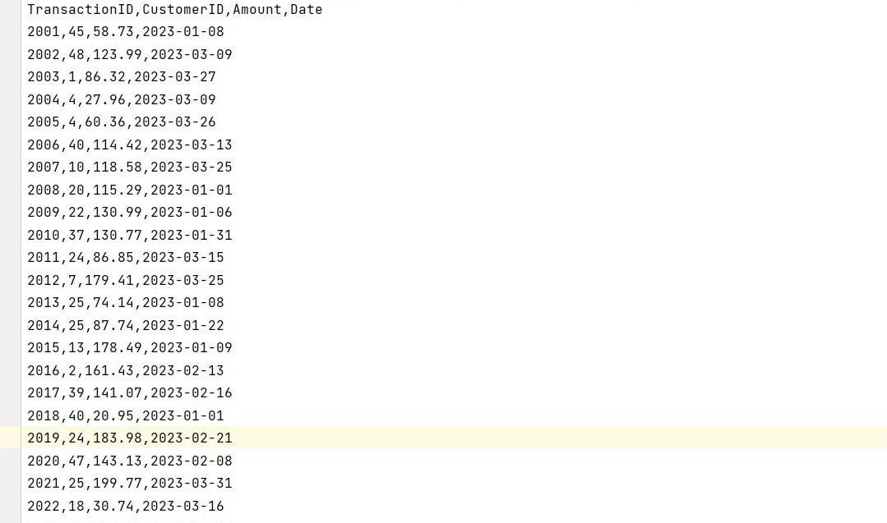
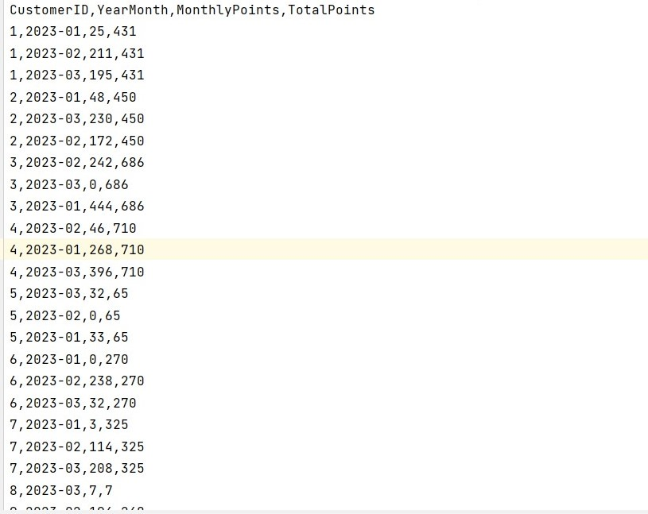

# Customer Rewards Program API

## Description

This Spring Boot application provides a RESTful API to calculate and retrieve reward points for customers based on their transactions. Customers earn points based on each recorded purchase as follows:

- For every dollar spent over $50 on the transaction, the customer receives one point.
- In addition, for every dollar spent over $100, the customer receives another point.

For example, a $120 purchase earns 90 points.

This API calculates the reward points earned for each customer per month and the total over a three-month period.

## Data Set

The data set is based on a record of transactions over a three-month period.



The resulting reward points for each customer are summarized in the following report:



## Setup

### Prerequisites

- Java JDK 11 or newer
- Maven or Gradle
- Git

### Installation

1. Clone the repository using Git:
   ```bash
   git clone [repository-url]
   ```
2. Navigate to the directory where the repository is cloned.
3. Build the application using Maven:
   ```bash
   mvn clean install
   ```
4. Once the build is successful, you can run the application:
   ```bash
   java -jar target/rewards-calculation-api-0.0.1-SNAPSHOT.jar
   ```

Alternatively, you can run the application directly from your IDE by executing the `main` method in the `Application` class.

## API Endpoints

The following API endpoints are available:

1. **Retrieve points for a specific customer for a specific month:**
   - `GET /customers/{customerId}/rewards/{year}/{month}`
   - Retrieves the reward points for a given customer ID for a specified month and year.

2. **Retrieve total points for a specific customer over a three-month period:**
   - `GET /customers/{customerId}/rewards/total`
   - Retrieves the total reward points for a given customer ID over a specified three-month period.

3. **Retrieve monthly points for all customers:**
   - `GET /customers/rewards/monthly`
   - Retrieves a list of all customers with their reward points for each month.

4. **Retrieve total points for all customers over a three-month period:**
   - `GET /customers/rewards/summary`
   - Retrieves a summary of total reward points for all customers over a specified three-month period.

## Testing

To run the automated tests for this system, execute the following command:

```bash
mvn test
```

This will run all unit and integration tests in the application.

### Testing with `curl`

You can also manually test the API using `curl` or any API client like Postman. Here are some example `curl` commands:

```bash
# Get monthly rewards for a customer
curl -X GET "http://localhost:8080/customers/1/rewards/2023/03"

# Get total rewards for a customer
curl -X GET "http://localhost:8080/customers/1/rewards/total"

# Get monthly rewards for all customers
curl -X GET "http://localhost:8080/customers/rewards/monthly"

# Get rewards summary for all customers
curl -X GET "http://localhost:8080/customers/rewards/summary"
```

## Deployment

To deploy this application, you can package it as a jar and run it on any server with Java installed. For containerized environments, you can create a `Dockerfile` and deploy it using Docker or Kubernetes.

## Contribution

Contributions are welcome. Please fork the repository and submit a pull request with your changes or suggestions.